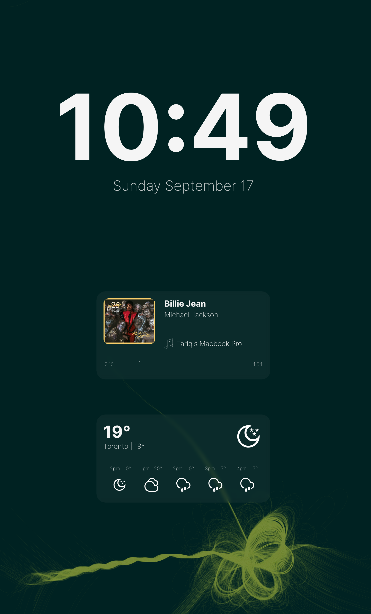

# Vision
## Overview
'Vision' is a web application designed to turn your Raspberry Pi or any other suitable device into an 'always-on' display that provides essential information at a glance. The app features a minimalist custom-built user interface created with React and showcases the current time, weather, and the currently playing song on Spotify.

